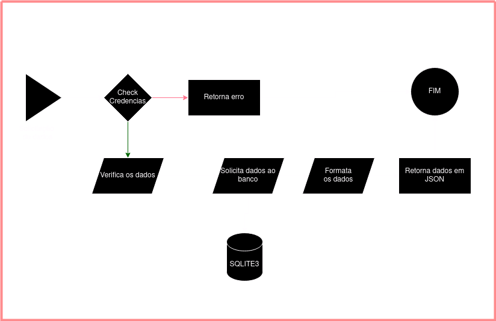

# JSON parser

Está é uma prova de conceito da capacidade de gerar um json a partir de uma chamada http.

## Como usar

Você ira precisar do instalar o NodeJS versão 18 ou superior.
O banco de dados disponibilizado aqui será um sqlite3, mas você pode usar qualquer outro banco de dados.
Alterando o arquivo .env na raiz do projeto.

## Diagrama de estado

> Nota: O diagrama de estado não está completo, mas é o suficiente para entender o funcionamento do sistema. As formas não estão de acordo com o padrão de diagramação UML"
